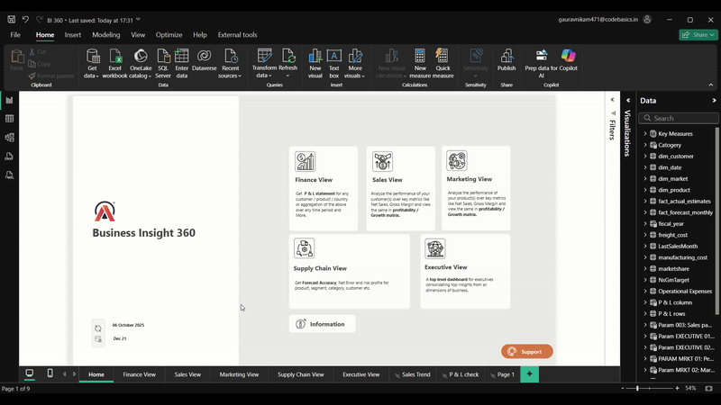
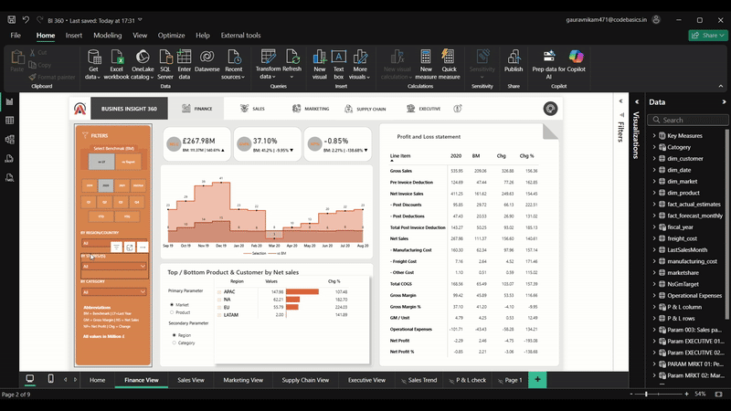
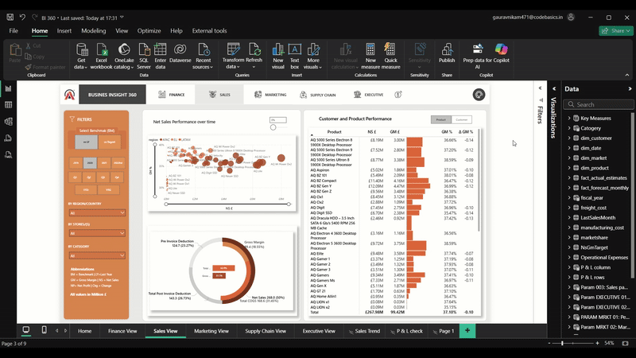
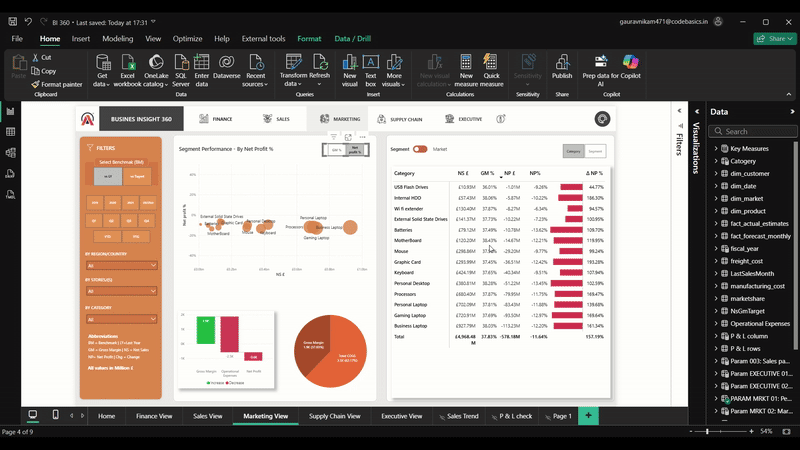
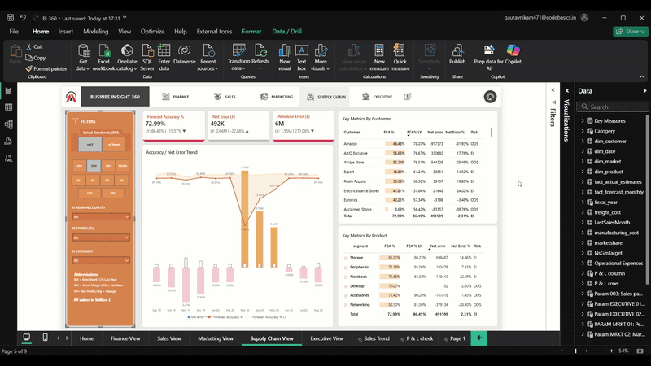
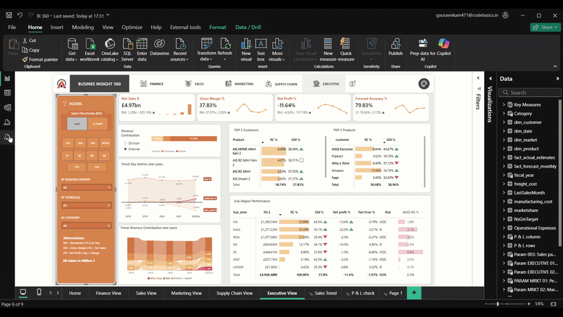

# 📊 Business Insight 360 — Enterprise Analytics Suite | Power BI


> **"360° visibility across Finance, Sales, Marketing, Supply Chain & Executive operations — replacing fragmented spreadsheet reporting with a single source of truth."**

🔗 **[▶ View Live Interactive Dashboard](https://app.powerbi.com/view?r=eyJrIjoiZDBjNjc0YjctZGZmMy00MDE3LTkzNWQtNDVhOGJkNmEyMDg3IiwidCI6ImM2ZTU0OWIzLTVmNDUtNDAzMi1hYWU5LWQ0MjQ0ZGM1YjJjNCJ9)**

---

## 🎯 Executive Summary

AtliQ Hardwares lacked a unified reporting layer across its business functions — leadership was making decisions from disconnected Excel reports with no cross-functional visibility. I designed and built an end-to-end enterprise Power BI solution covering 5 business domains on a 1.8M+ row star-schema data model, enabling leadership to benchmark performance against prior year and targets in real time.

---

## 🛠 Tech Stack

| Layer | Tools Used |
|---|---|
| **Data Modelling** | Star Schema — 3 fact tables, 4 dimension tables |
| **ETL & Transformation** | Power Query (M Language) |
| **Analytics & Measures** | DAX — CTEs, dynamic benchmarks, YoY variance, conditional formatting measures |
| **Visualization** | Power BI Desktop + Power BI Service (published report) |
| **Data Sources** | MySQL + Excel flat files |
| **UX** | Custom JSON theme, bookmark navigation, tooltip pages, slide-in filter panel |

---

## 🧹 Data Cleaning & Transformation

**1. Multi-source consolidation via Power Query**
Raw data arrived from two systems — MySQL transactional tables and Excel cost files. I merged fact tables (sales + manufacturing costs + deduction estimates) using M Language, resolving key mismatches and removing absolute file path dependencies so the model is portable.

**2. Fiscal calendar engineering**
AtliQ operates on a non-standard fiscal year (Sept–Aug). I built a custom `dim_date` table in Power Query, deriving fiscal month numbers, fiscal year labels, and quarter mappings — ensuring all time intelligence DAX functions produce correct period-over-period comparisons.

**3. P&L row structure via utility table**
A standard star schema cannot natively represent a dynamic P&L (Gross Sales → Deductions → Net Sales → COGS → Gross Margin → Expenses → Net Profit). I solved this by creating a `P&L rows` utility table, allowing row-level P&L logic to be driven by DAX filters rather than hardcoded columns.

**4. Benchmark parameterization**
Instead of duplicating measures for "vs Last Year" and "vs Target," I built a `Set BM` field parameter that dynamically switches the benchmark across all pages — halving the measure count and eliminating inconsistency across views.

---

## 💡 Business Insights — The "So What?"

- **Identified that Net Profit margin fell below 0% in key markets** despite strong Gross Margin figures, signalling that operating expense ratios were eroding profitability — enabling leadership to prioritize cost-structure reviews in high-revenue, low-NP markets.

- **Revealed a forecast accuracy gap exceeding threshold in specific product segments**, which directly mapped to stockout and excess inventory events — providing the Supply Chain team with a data-backed case to revise safety stock policies for high-variance SKUs.

- **Uncovered that the top 5 customers by Net Sales contributed a disproportionate share of revenue with below-average Gross Margin %**, indicating that high-volume discount agreements were compressing profitability — framing a direct input for the next customer contract renegotiation cycle.

---

## 📋 Business Recommendations

Based on the analysis across all 5 views, the following actions are recommended:

1. **Margin Recovery Review** — Launch a market-level cost audit for regions where Net Profit % is negative despite positive Gross Margin, focusing on freight, operational, and overhead costs.
2. **Discount Policy Reform** — Restructure pre-invoice deduction agreements for the top 10 customers by volume, targeting a minimum GM% floor per customer segment.
3. **Forecast Model Improvement** — Prioritize improving forecast accuracy for the top 20% of SKUs by revenue contribution — a 5-point improvement in Forecast Accuracy % would materially reduce both stockouts and write-offs.
4. **Executive Reporting Cadence** — The Executive View should be used as a monthly leadership review artifact, replacing ad-hoc spreadsheet summaries sent via email.

---

## 📸 Dashboard Preview

| View | Preview |
|---|---|
| 🏠 Home |  |
| 💰 Finance |  |
| 📈 Sales |  |
| 📣 Marketing |  |
| 🚚 Supply Chain |  |
| 👔 Executive |  |

---

## 🏗 Data Model Architecture
```
dim_date ──────────────┐
dim_product ───────────┤──► fact_sales_monthly
dim_customer ──────────┤──► fact_forecast_monthly  
dim_market ────────────┘──► fact_actual_estimates
                            + manufacturing_costs
                            + invoice_deductions
```

**Model type:** Star Schema | **Granularity:** Monthly product-customer level

---

## ⚡ Key DAX Measures
```dax
-- Dynamic Benchmark (switches between LY and Target via parameter)
Net Sales BM = IF([Set BM] = "Last Year", [Net Sales LY], [Net Sales Target])

-- Gross Margin %
GM % = DIVIDE([Gross Margin], [Net Sales], 0)

-- YoY Net Sales Growth
NS Growth % = DIVIDE([Net Sales] - [Net Sales LY], [Net Sales LY], 0)

-- Forecast Accuracy
Forecast Accuracy % = 1 - DIVIDE([Absolute Error], [Forecast Qty], 0)
```

---

## 🗂 Repository Structure
```
Business_Insight_360/
├── README.md
├── *.gif               ← Dashboard page previews
└── gifs/               ← Additional preview assets
```
> 📎 The `.pbix` source file is available on request — contact via LinkedIn or email.

---

## 👤 Author

**Gaurav Nikam** — Data Analyst | Power BI · SQL · Excel · Bloomberg Terminal
📧 gauravnikam471@gmail.com
🔗 [LinkedIn](https://www.linkedin.com/in/-471-gaurav-nikam)
